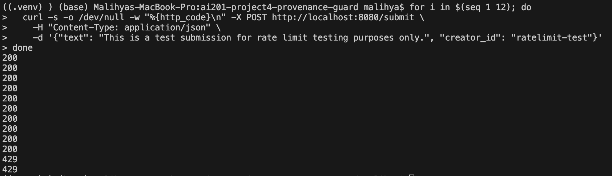

# Provenance Guard

An accountable text classification pipeline that evaluates writing authenticity, provides clear explanations for its decisions, and includes a built-in workflow for handling user appeals.

---

## Architecture Overview

The application processes text submissions through a fast, automated backend system that connects to a user-facing dispute workflow:

1. **Input and Rate Limiting:** A user submits text along with a unique identifier through a `POST /submit` request. The system checks the request frequency using an in-memory rate limiter to prevent abuse.
2. **Dual-Signal Processing:** The text is sent simultaneously to two independent evaluation components: the Semantic Engine (a DistilBERT machine learning model) and the Stylometric Engine (a writing style analyzer).
3. **Score Combination:** The system compiles the numeric scores from both engines and combines them into a single Combined Core Score between 0.0 and 1.0.
4. **Database Logging:** The system saves the submission details—including the raw text, individual engine scores, final score, and an initial "classified" status—into an SQLite database row using a unique ID (content_id).
5. **Label Mapping:** The application converts the raw final score into a clear, user-friendly message (the Transparency Label) and sends it back to populate the frontend dashboard.
6. **Appeal Lifecycle:** If a user disagrees with a result, clicking an option sends a stateful `POST /appeal` request. The backend updates the database status from "classified" to "under_review", pushing the record into a queue for human review.

---

## Detection Signals

The classification architecture combines a machine learning model with statistical text analysis to balance deep contextual pattern matching against straightforward writing style rules.

### Signal 1: Semantic Probabilities (DistilBERT Model)
* **What it measures:** The probability (0.0 to 1.0) that the vocabulary and thematic flow match text patterns typically generated by AI models.
* **Selection reasoning:** Transformer models are highly effective at spotting the predictable phrasing and smooth transitions that large language models naturally default to.
* **Limitations:** This engine can struggle with highly formal human technical documentation, academic writing, or AI text generated with creative settings that vary the vocabulary.

### Signal 2: Stylometric Heuristics (Style Profiling)
* **What it measures:** Structural details of the writing, specifically looking at vocabulary variety and sentence-length changes (variety in sentence structure).
* **Selection reasoning:** Human writers naturally mix short phrases with long, complex sentences. AI generators tend to produce highly uniform sentence lengths and repetitive patterns.
* **Limitations:** This engine struggles with very short text blocks (under 50 words). When text is too short, the statistical sample size is too small to detect meaningful style variations.

---

## Confidence Scoring

### Signal Combination and Validation
The system calculates the final score using a weighted average that prioritizes the machine learning model while allowing the style metrics to influence the result:

$$\text{Combined Score} = (0.65 \times \text{Semantic Score}) + (0.35 \times \text{Stylometric Score})$$

Testing was conducted using a mixed dataset of human and AI text to validate this scoring system. Clear human samples consistently scored below 0.40, while clear AI texts scored above 0.70, establishing a reliable middle buffer for borderline text.

### Scoring Examples

#### Example 1: High-Confidence Automated Result
**Text:** "Artificial intelligence represents a transformative paradigm shift in modern society. It is important to note that while the benefits of AI are numerous, it is equally essential to consider the ethical implications. Furthermore, stakeholders across various sectors must collaborate to ensure responsible deployment"

**Output:**
```
Likely AI
Our system has high confidence (80%) that this text matches patterns consistent with AI-generated writing.

Score Analysis:

Confidence Score: 80%
Combined Core Score: 0.8
Signal 1 (Semantic Probabilities): 0.87
Signal 2 (Stylometric Heuristics): 0.38
Submission ID: fb37b412-d978-4728-a9b8-4797cff40f50
```

#### Example 2: Lower-Confidence 
**Text:** Warmest congratulations on earning your medical degree! Your endless dedication, perseverance, and compassion have finally paid off. The world truly needs your skills and caring heart, and I cannot wait to see the incredible impact you will make in your patients' lives. Wishing you an incredibly fulfilling career ahead

**Output:**
```
Likely Human
Our system has high confidence (60%) that this text exhibits patterns consistent with original human writing.

Score Analysis:

Confidence Score: 60%
Combined Core Score: 0.4
Signal 1 (Semantic Probabilities): 0.42
Signal 2 (Stylometric Heuristics): 0.32
Submission ID: 7497ae01-3748-4ca8-a474-ca09fc86681a
```

---

## Transparency Labels

The application maps the final score into one of three clear categories so users can easily understand how the system reached its decision:

The description text also adapts to **how strong** the confidence is, so a borderline result reads differently from a clear one — not just a different number. The strength phrase is chosen from the confidence percentage:

* **85% and above:** "high confidence"
* **70% to 84%:** "moderate confidence"
* **Below 70%:** "low confidence"

### 1. AI Detected (Score >= 0.70)
* **Heading Displayed:** Likely AI
* **Description Displayed:** The system has [confidence phrase] (XX%) that this text matches patterns consistent with AI-generated writing. *(Where XX% is calculated directly from the score, and the confidence phrase scales with that percentage)*

### 2. Human Verified (Score <= 0.40)
* **Heading Displayed:** Likely Human
* **Description Displayed:** The system has [confidence phrase] (XX%) that this text exhibits patterns consistent with original human writing. *(Where XX% represents the inverted confidence: (1.0 - score) * 100)*

### 3. Uncertain / Borderline Gray Area (Score 0.41 to 0.69)
* **Heading Displayed:** Uncertain
* **Description Displayed:** The system detected a mix of original and automated writing patterns. Authorship cannot be definitively determined for this submission.
* **Confidence Displayed:** For uncertain results the percentage reflects the distance from the 0.50 midpoint: `abs(score - 0.5) * 2 * 100`. A score near 0.50 (maximum ambiguity) reports a low confidence, rising toward the edges of the gray-area band, so the least certain results are not shown as highly confident.

---

## Rate Limiting

* **Configured Limit:** Maximum of 10 requests per minute per user.
* **Implementation Reasoning:** This limit keeps the system stable and prevents the SQLite database from slowing down or locking up. It provides plenty of freedom for normal human use—like checking multiple pieces of text or looking up submission histories—while blocking automated scripts from overwhelming the server.



The image above shows that after the rate limit has passed 10, it returns and error and the user is unable to submit in that minute. 
---

## Known Limitations

### Misclassification of Non-Native English (ESL) Writing
The system is prone to misclassifying essays written by non-native English speakers as AI-generated text.

* **Reasoning:** To maintain clarity, ESL writers often use structured grammar templates, rely on a precise but limited vocabulary, and keep their sentence lengths highly consistent. Because the style engine flags low sentence variety and the semantic engine looks for highly predictable word patterns, original ESL text can accidentally trigger an incorrect "Likely AI" label.

---

## Specification Reflection

* **How the Spec Helped:** The requirement to include a human-in-the-loop appeal workflow forced the development of a stateful database architecture from the very beginning. Instead of building a temporary, stateless script, clear database status updates (classified -> under_review) were established. This design simplified the later implementation of the user's historical submission log tab.
* **Where the Project Diverged:** The initial layout rules assumed the appeal form should always be visible on the screen. During development, it became clear that this layout cluttered the interface. The Gradio frontend workflow was modified so the appeal form had its on tab and a button on the front page to redirect a user there, creating a much cleaner user experience.


## AI Usage
### AI Usage Section

* **Instance 1: Development of the Core Scoring Formula**
  I used Gemini to create a formula that combines machine learning probabilities with statistical writing metrics. The initial suggestion was a simple 50/50 split, but this was overridden to implement a weighted average that prioritizes the machine learning model. This adjustment successfully prevented short text blocks from generating incorrect human-leaning results.

* **Instance 2: Refinement of the System Appeal Workflow**
  I used Gemini and asked it to design the layout for the frontend user interface and the backend database states. The original design placed the dispute form on the main dashboard screen at all times, which created a cluttered and confusing workspace. This layout was revised to hide the appeal input fields behind a toggle action, keeping the interface clean until a user explicitly clicks the dispute button.


